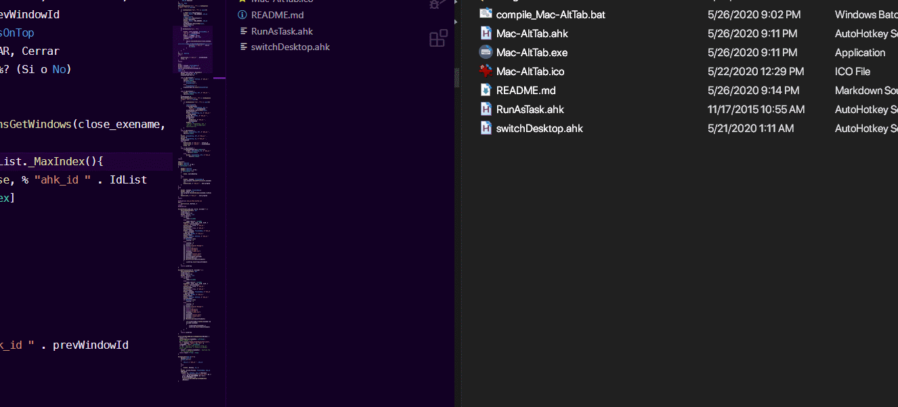

# MacOS Alt-Tab mimic <!-- omit in toc -->

Windows promotes _multitasking distraction_ by putting all windows on the same Alt-Tab list. Conversely, MacOS only lets you to change application. With this application you will be able to overcome Windows distraction by mimicking MacOS Alt-Tab behaviour on Windows.

- [Demo](#demo)
- [Key Shortcuts](#key-shortcuts)

## Demo

Press Alt+Tab to change between applications. Windows+Tab to change between windows of the same application.

## Key Shortcuts

| Hotkey                      | Action                                     |
| --------------------------- | ------------------------------------------ |
| `!Tab` or `2xCapslock`      | Change application.                        |
| `#Tab` or `1xCapslock`      | Change window inside aplication.           |
| `!Capslock` or `3xCapslock` | Change desktop.                            |
| `Esc` while AltTabbing      | Close all windows of selected application. |