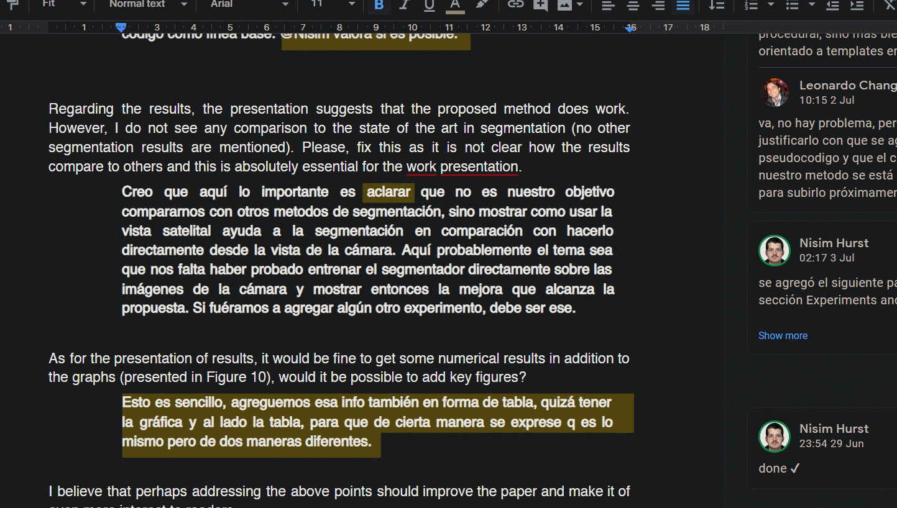

# macOS Command+Tab mimic <!-- omit in toc -->

Windows promotes _multitasking distraction_ by putting all windows on the same Alt+Tab list. Conversely, macOS only lets you to change application. With this application you will be able to overcome Windows distraction by mimicking macOS Command+Tab behavior on Windows.

- [Demo](#demo)
- [Key Shortcuts](#key-shortcuts)
- [Disclaimer](#disclaimer)

## Demo

Press Alt+Tab to change between applications. Windows+Tab to change between windows of the same application.

Press Windows+Tab to change between windows inside the selected application.

## Key Shortcuts

| Hotkey                         | Action                                     |
| ------------------------------ | ------------------------------------------ |
| `Alt+Tab` or `2xCapslock`      | Change application.                        |
| `Alt+Shift+Tab`                | Change application in reverse order.       |
| `Win+Tab` or `1xCapslock`      | Change window inside aplication.           |
| `Alt+Capslock` or `3xCapslock` | Change desktop.                            |
| `Esc` while AltTabbing         | Close all windows of selected application. |

## Disclaimer

- Mac Fonts can be downloaded in Windows by decompressing [SF Font](https://developer.apple.com/design/downloads/SF-Font-Pro.dmg) with 7Zip from [Apple's web site](https://developer.apple.com/fonts/).